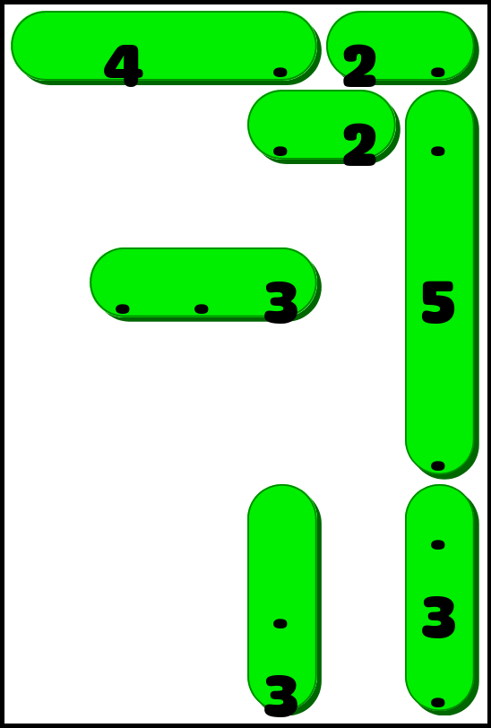

# Linjat solver

This is a solver of the [Linjat](https://linjat.snellman.net) game.

The rules of Linjat are simple:

- Cover each number with a line of that length
- Cover all the dots with lines
- Lines can't cross

Here's an unsolved board:


And here is the solution:



## Solving levels

After installing the dependencies with `pip3 install -r requirements.txt`,
you can run the solver like `./main.py easy 1`. This will print something like:

```
4 .2.
  .2.

..3 5

    .
    .
  . 3
  3 .
Solved puzzle 1 of the easy levels in 0.19 seconds
aaaabb
  ccd
    d
eee d
    d
    d
  f g
  f g
  f g
```

The letters of the solution will be colored in different colors to make it
easier to see what tile belongs to what line.
